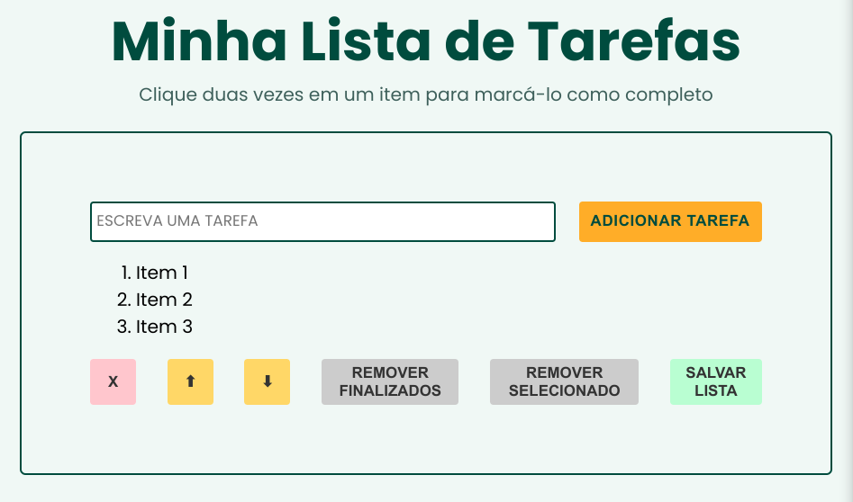

# Projeto Todo List  ─ um clássico

Este projeto é um sistema simples de gerenciamento de tarefas que permite aos usuários adicionar, marcar como concluídas e remover tarefas. Também possui funcionalidades para mover tarefas para cima e para baixo na lista, remover tarefas concluídas ou selecionadas e salvar a lista no localStorage.

## Stack utilizada

- HTML
- CSS
- Javascript

## Funcionalidades

- Adiciona tarefas
- Marca tarefas como concluídas
- Seleciona tarefas
- Move tarefas selecionadas
- Remove tarefas finalizadas, selecionadas ou todas as tarefas
- Salva lista de tarefas (localStorage)
- Recarrega tarefas salvas

## Demonstração

## Screenshots

## Contribuindo

Sinta-se à vontade para fazer fork deste projeto e contribuir com suas próprias melhorias.

## Licença

[MIT](https://choosealicense.com/licenses/mit/)

## Autores

- [@cecilia-martins](https://github.com/cecilia-martins)

